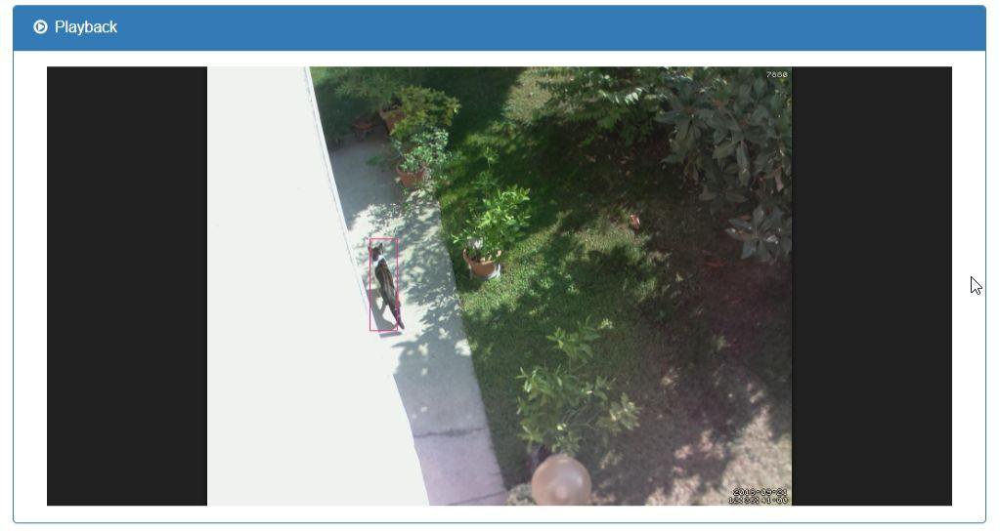

  

* TOC 
{:toc}

# Introducing PiWebcam

With PiWebcam you can turn a **Raspberry Pi** into a **fully-featured, dummy-proof Webcam** with just one click.

Even if there are already around a number of projects for using a Raspberry Pi as a webcam, they often require advanced knowledge and skills and look like more ad-hoc solutions rather than finite, reusable products.

PiWebcam is intended to provide a **powerful imaging platform for everyone**, regardless of his/her previous knowledge.

PiWebcam ships as an **ready-to-be-flashed SD card image**. Alternatively, an installation script takes care of fully configuring a vanilla Raspbian with the required software and reasonable default settings. 

Thanks to its powerful **motion detection** feature, augmented by an **object recognition** capabilities, PiWebcam can notify the user by sending the motion picture to an **e-mail** recipient or a **Slack** channel.

## Features

* Can be installed and configured by running a single command
* Simple, mobile-friendly web interface
* Snapshot and video recording upon motion detection
* AI-based object recognition capabilities to prevent false positives
* E-mail and Slack notifications
* Can act as an Access Point or connect to an existing WiFi network
* Can be accessed from the Internet without any additional configuration
* Survive to any power outages
* Can switch automatically to night mode and control IR Leds and IR Cut filter
* Old files are automatically purged when the SD card is almost full
* Ability to import/export the entire configuration of the device
* Queue notifications when offline

## Requirements

* Raspberry Pi Model 3 or Raspberry Pi Zero W
* Raspberry Pi Camera (any model) or a Generic USB Camera
* SD Card (16GB recommended)

# Installation

## Option 1: flash a pre-configured PiWebcam image

* Download the latest PiWebcam image (PiWebcam_vX.X.img.zip) from <https://github.com/piwebcam/PiWebcam/releases>
* Unzip the file
* Write the image to a SD card (<https://www.raspberrypi.org/documentation/installation/installing-images/>)
* Plug the SD card on your Raspberry Pi and power it on
* The device will start acting as an Access Point
* Continue with the post-installation tasks

## Option 2: build a PiWebcam image

Building a PiWebcam image requires a fresh installation of Raspbian and a SD card. Please do not re-use an existing installation but start from scratch as listed below:

* Download Raspbian Stretch Lite operating system (<http://downloads.raspberrypi.org/raspbian_lite/images/raspbian_lite-2019-04-09/2019-04-08-raspbian-stretch-lite.zip>)
* Unzip the image
* Write the image to a SD card (<https://www.raspberrypi.org/documentation/installation/installing-images/>)
* Download the latest release of PiWebcam (PiWebcam_vX.X.zip) from <https://github.com/piwebcam/PiWebcam/releases>
* Extract and copy the `PiWebcam` directory into the boot partition (on Windows, the only one accessible)
* For a headless setup, review https://www.raspberrypi.org/documentation/configuration/wireless/headless.md
* Plug the SD card on your Raspberry Pi, power it on and connect to it through SSH (Hostname: raspberrypi.local, Username: pi, Password: raspberry)
* Ensure the Raspberry is connected to Internet
* Run `sudo /boot/PiWebcam/PiWebcam.sh install` to set up the system and install all the dependencies
* At the end of the installation you will be requested to reboot the device to make the changes fully effective. All the credentials will be summarized on the screen. 
* Once rebooted, the device will start acting as an Access Point
* Continue with the post-installation tasks

## Default Credentials

* **WiFI Access Point**:
    * **SSID**: PiWebcam-*XXXXX*"
    * **Passphrase**: PiWebcam-*XXXXX*
* **Web**:
    * **Username**: admin
    * **Password**: PiWebcam-*XXXXX*
* **SSH**:
    * **Username**: admin
    * **Password**: PiWebcam-*XXXXX*
    
Where *XXXXXX* are random characters set during the installation process (e.g. *PiWebcam-d68c2f*)

## Post-installation tasks

Connect to the WiFi network created by the device. The passphrase of the network as well as the password of the admin user (for both the web interface and SSH) is the same as the SSID (e.g. PiWebcam-XXXXX). Point your browser to http://PiWebcam.local to finalize the configuration.

To connect the webcam to an existing WiFi network, go to Device / Network, select "*WiFi Client*" and fill in your
"*WiFi Network*" and "*Passphrase*".

The entire device configuration (camera, network, notification and system settings) can be performed through the web interface. 
The configuration file can be easily exported and imported under Device / System. 

Furthermore, the configuration file (`PiWebcam.conf`) is stored in the boot partition under the PiWebcam folder and can be altered or copied out from there as well.

# Configuration

PiWebcam already comes with reasonable default settings. Once installed, no additional configuration is required; PiWebcam will start taking snapshots and record videos, whether is connected or not to the network.

To access the webcam and/or customize the settings, connect to the web admin panel.

For a detailed description of the menus available through the web interface and CLI commands, please see the [User Guide](https://github.com/piwebcam/PiWebcam/wiki/User-Guide)

# Screenshots

  

  

  

  

  

  

# Resources

* Project Page: <https://piwebcam.github.io>
* User Guide: <https://github.com/piwebcam/PiWebcam/wiki/User-Guide>
* Instructables: <https://www.instructables.com/id/Fully-featured-Outdoor-Security-Camera-Based-on-Ra/>
* Download: <https://github.com/piwebcam/PiWebcam/releases>
* Bug Report: <https://github.com/piwebcam/PiWebcam/issues>
* Technical Overview: <https://github.com/piwebcam/PiWebcam/wiki/Technical-Overview>
* Hardware BOM: <https://github.com/piwebcam/PiWebcam/wiki/Hardware-BOM>
